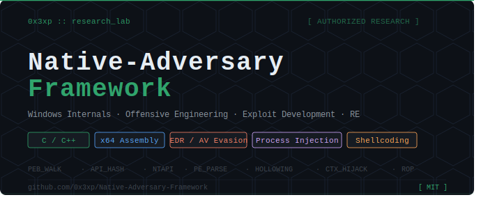

# Native-Adversary-Framework
### 🛠️ Advanced Research Lab: Windows Internals, Exploit Dev & Malware Engineering

[](https://opensource.org/licenses/MIT)
[](https://en.cppreference.com/w/c)
[](https://isocpp.org/)
[](https://www.nasm.us/)

**Native-Adversary-Framework** is a professional-grade research repository documenting my work in offensive security and low-level systems programming. This project showcases the synergy between **C**, **C++**, and **x64 Assembly** to subvert modern Windows security mitigations by interacting directly with the OS's internal structures.

---

## 🔬 Core Technical Pillars

### 1. Offensive Engineering (C/C++)
Implementation of sophisticated payload delivery and execution vectors using the Win32 and Native API (NTAPI).
* **Process Injection:** Advanced techniques including **Process Hollowing**, **Thread Context Hijacking**, and **NTAPI Section Mapping**.
* **System Reconnaissance:** Native implementations of host discovery tools using APIs like `NetUserEnum`, `GetAdaptersInfo`, and `EnumServicesStatusEx`.
* **Credential Harvesting:** Research into data recovery using `CryptUnprotectData` and LSA session enumeration.

### 2. Stealth & Evasion (x64 ASM & Internals)
Operating beneath the visibility of EDR/AV by manipulating hardware-level structures.
* **PEB Walking:** Custom x64 ASM logic to traverse the **Process Environment Block** (`gs:[0x60]`) for module resolution, bypassing the need for `GetProcAddress`.
* **API Hashing:** Reducing static signatures by implementing custom hashing algorithms to resolve functions at runtime.
* **Anti-Analysis:** Detecting debuggers and virtualized environments through `NtQueryInformationProcess` and timing-based side-channel checks.


### 3. Exploit Development & Reverse Engineering
Deep analysis of binary vulnerabilities and the Portable Executable (PE) format.
* **Custom Shellcoding:** Writing 100% position-independent, null-free x64 assembly code.
* **Binary Analysis:** Custom C-based parsers for the **PE File Format**, including IAT/EAT reconstruction and section header analysis.
* **Logic Subversion:** Practical examples of binary patching and bypassing software validation through instruction-level modification.


---

## 🏗️ Repository Architecture

```text
📂 Native-Adversary-Framework
├── 📂 Assembly-Lab             # Low-Level Foundations, Technical Briefs, and PoC Snippets
│   ├── 📂 Technical-Briefs     # Architecture notes, Win64 calling conventions, and ISA theory
│   └── 📂 PoC-Snippets         # Raw .asm samples, register experiments, and logic tests
├── 📂 Core-Engine              # Pure C/C++ Headers, Internal Structs (PEB/TEB), and Hash Logic
│   └── 📂 Cryptography         # Low-level XOR and encryption routines for obfuscation
├── 📂 Exploit-Dev              # x64 Shellcode, ROP Chains, and Memory Corruption
│   ├── 📂 HTB-x86-Windows-BO   # Lab logs and exploit development for HTB challenges
│   ├── 📂 Exploits             # Proof-of-concept code for identified vulnerabilities
│   ├── 📂 Fuzzers              # Custom scripts for automated vulnerability discovery
│   ├── 📂 Shellcode-Runners    # C/C++ implementations for in-memory payload execution
│   └── 📂 Shellcodes           # Custom assembly stubs and PEB-walking API resolvers
├── 📂 Malware-Dev              # Injection, Persistence, and Evasion Modules
│   ├── 📂 Delivery             # Modules for initial access payloads and dropper stubs
│   ├── 📂 Evasion              # Research and implementation of AV/EDR bypass techniques
│   ├── 📂 Injection            # Source code for process injection and thread hijacking
│   └── 📂 Recon                # Environmental keying and sandbox detection modules
└── 📂 Reverse-Engineering      # Custom PE Parsers, Binary Analysis, and RE Writeups
    ├── 📂 Binary               # Collection of crackmes and binaries for analysis practice
    └── 📂 Writeups             # Detailed technical walkthroughs of the RE process
